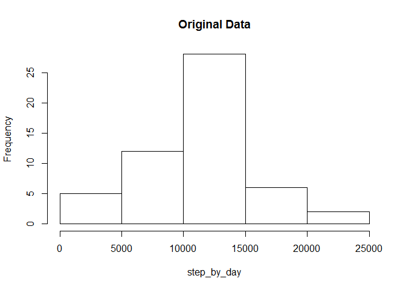
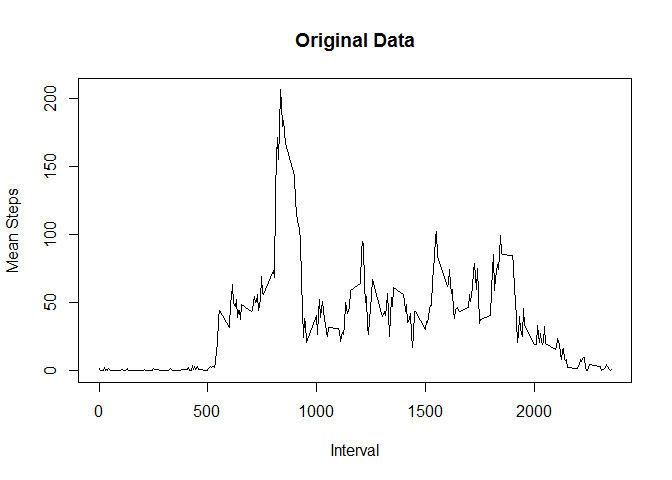
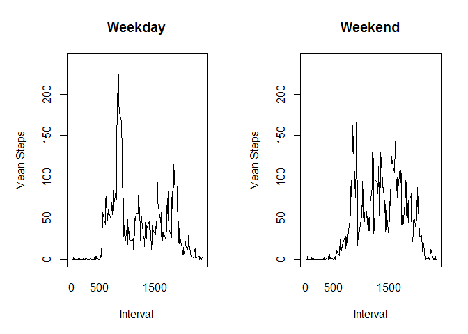

# RR-Project-1


# Reproducible Research --- Project 1

##  Analysis with NA ingnored

- Setup figure diretory


```r
knitr::opts_chunk$set(fig.path="figures/")
```

- Load data


```r
  data <- read.csv(file="activity.csv", header = TRUE)
```

- Calculate total steps of each day


```r
  step_by_day <- with(data, tapply(steps, date, sum))
```
  
- Create a  Histgram


```r
  orig_hist <- hist(step_by_day, main = "Original Data")
```

<!-- -->

```r
  ## for comparison with new data set below
  orig_hist$count
```

```
## [1]  5 12 28  6  2
```
  
-  Calculate mean and median, ignoring NAs


```r
  mean(step_by_day, na.rm = TRUE)
```

```
## [1] 10766.19
```

```r
  median(step_by_day, na.rm = TRUE)
```

```
## [1] 10765
```
  
-  Calculate mean by interval


```r
  mean_by_interval <- with(data, tapply(steps, interval, mean, na.rm = TRUE))
```
  
- Create a  time series plot of mean steps averaged across all days


```r
  t_series <- subset(data, date == "2012-10-01")$interval
  plot(t_series, mean_by_interval, type = "l", xlab="Interval", ylab = "Mean Steps", main = "Original Data")
```

<!-- -->

-  find the maximum


```r
    max(mean_by_interval)
```

```
## [1] 206.1698
```

```r
    which(mean_by_interval == max(mean_by_interval))
```

```
## 835 
## 104
```
   
## Imputing missing values: replacing NAs with the mean of the interval

- Calculate and report the total number of missing values in the dataset (i.e. the total number of rows with NAs)


```r
  sum(is.na(data$step))
```

```
## [1] 2304
```

**Discusion:** 2304 out of 17568 observations missing, about 13%


-  use Mean of the interval to replace NA


```r
  num_of_dates <- nrow(step_by_day)
  num_0f_interval <- nrow(mean_by_interval)
  
  
  new_data <- data.frame (steps = numeric(), date = factor(), interval = integer() )  
  d1 <- as.Date("2012-10-01")
  for (i in 1:num_of_dates) {
      d <- as.Date(d1 + i - 1)
          tmp_data <- subset(data, date == as.character(d))
          
          
          for (j in 1:num_0f_interval) {
                steps <- tmp_data[j,1]
                if (is.na(steps)) {
                  steps <- mean_by_interval[j]
              }
            
          
              if(!exists("new_data")) {
                  new_data <- c(steps, d, t_series[j])
              }
              else {
                 tmp_row <- c(steps, d, t_series[j])
                 new_data <- rbind(new_data, tmp_row)
              }
          } 
            
  }
  
  colnames(new_data) <- c("steps","date","interval")
  new_data$date <- as.Date(new_data$date, origin ="1970-01-01")
```

## Statistics with new data set (NAs replaced by mean of the interval)

-  Calculate total steps of each day and Plot a histgram


```r
  step_by_day_2 <- with(new_data, tapply(steps, date, sum))
  
  new_hist <- hist(step_by_day_2, main = "Modified Data")
```

<!-- -->

```r
  ## for comparison with original data set
  new_hist$count
```

```
## [1]  5 12 36  6  2
```

- Calculate mean and median, 
 

```r
  mean(step_by_day_2, na.rm = TRUE)
```

```
## [1] 10766.19
```

```r
  median(step_by_day_2, na.rm = TRUE)
```

```
## [1] 10766.19
```


**Discussion:** After imputing NAs, median and mean steps did not change with any significance, most likely due to the fact that NAs were replaced by mean of the interval. However, the peak of the histagram with steps between 10000 and 15000, increased significantly, while other bins have significant change. This deserves further investigation.


- Add a new column, wday, two level factor, weekday or weekend


```r
    weekday <- c("Monday", "Tuesday", "Wednesday", "Thursday", "Friday")
    wday_vector <- factor((weekdays(as.Date(new_data$date)) %in% weekday), levels=c(TRUE, FALSE), labels=c("weekday", "weekend"))
    new_data$wday <- wday_vector
```

- Calculate mean by interal for weekday and weekend
- Make a panel plot of mean steps ~ interval for weekday and weekend


```r
    mean_by_interval_wday <- with(new_data, tapply(steps, list(wday, interval), mean))

    par(mfrow = c(1,2), mar = c(5, 5, 4, 2))
    plot(t_series, mean_by_interval_wday["weekday",], type ="l", ylim = c(0, 240), xlab = "Interval", ylab = "Mean Steps", main = "Weekday")
    plot(t_series, mean_by_interval_wday["weekend",], type ="l", ylim = c(0, 240), xlab = "Interval", ylab = "Mean Steps", main = "Weekend")
```

<!-- -->
